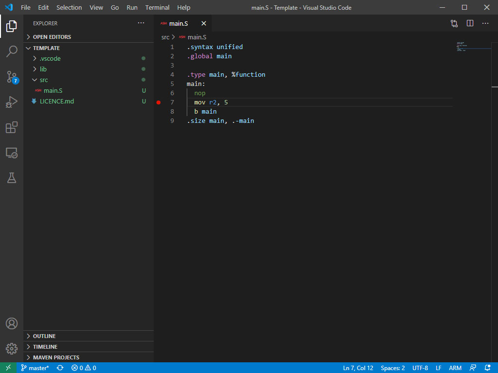
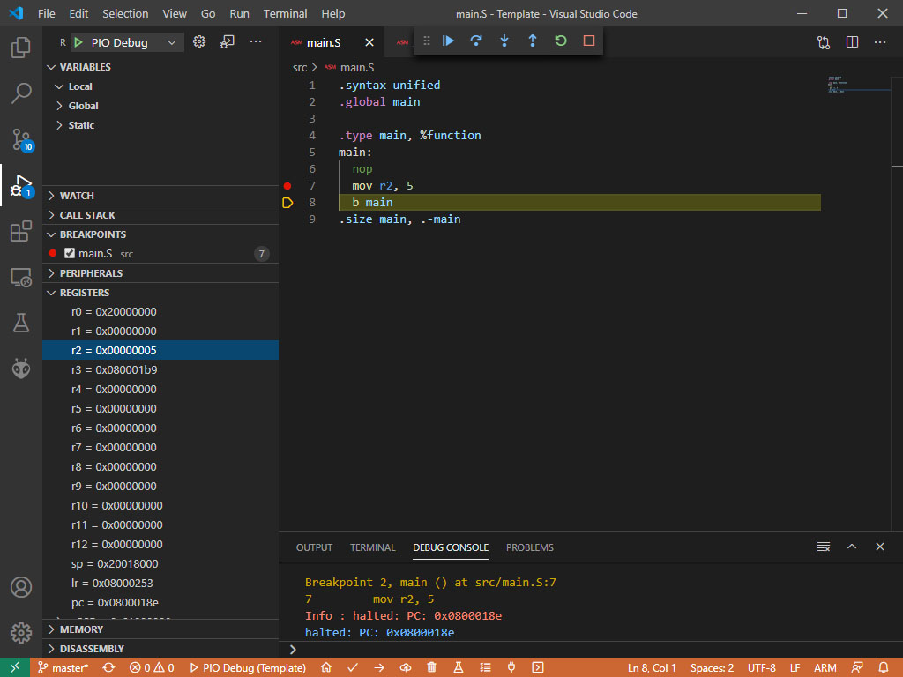

# Week 1 - Installation Guide

## Visual Studio Code
Download [Visual Studio Code](https://code.visualstudio.com/Download) and install.

## COMP2300 Extension
1. Launch VS Code and open the extensions tab (Windows: Ctrl + Shift + X, Mac: CMD + Shift + X, or by selecting the extensions tab on the left sidebar)
1. Search for `comp2300-anu.comp2300-extension-pack`
1. Click `Install`
1. Click `Reload` when prompted
1. Wait for installation to finish (this will take a while)
1. Windows users only (Mac/Linux users skip this step): 
    1. Download [ST-Link Windows Driver](https://github.com/CanberraGrammar/cc-ext-2020-discoboard/raw/master/Week%201%20-%20Installation%20Guide/stlink-windows-driver.zip)
    1. Extract the ZIP
    1. Run either `dpinst_amd64.exe` or `dpinst_x86.exe` depending on whether you are on a 64-bit machine or 32-bit machine.

## Check Installation
1. Clone this repo to your computer
    - Open terminal/command prompt and run `git clone https://github.com/CanberraGrammar/cc-ext-2020-discoboard.git`
1. Open the `Template` folder (in the week 1 folder) in VS Code
1. Connect your discoboard to your computer
1. Open the command palette (Windows: Ctrl + Shift + P, Mac: CMD + Shift + P) and run `PlatformIO: Upload`

## Check Register Inspector
1. Write some code to move a value into a register below the `nop` in the `main.s` file (under src)
    - e.g. `mov r2, 5`
1. Place a breakpoint on your new line
    - This can be done clicking to the left of the line number
    
1. Open the run tab (Windows: Ctrl + Shift + D, Mac: CMD + Shift + D, or by selecting the run tab on the left sidebar)
1. Click PIO Debug
1. Expand the `REGISTERS` tab
1. Step into the program (using the buttons at the top)
1. Once your line has been run, check that your value has been moved into selected register
    